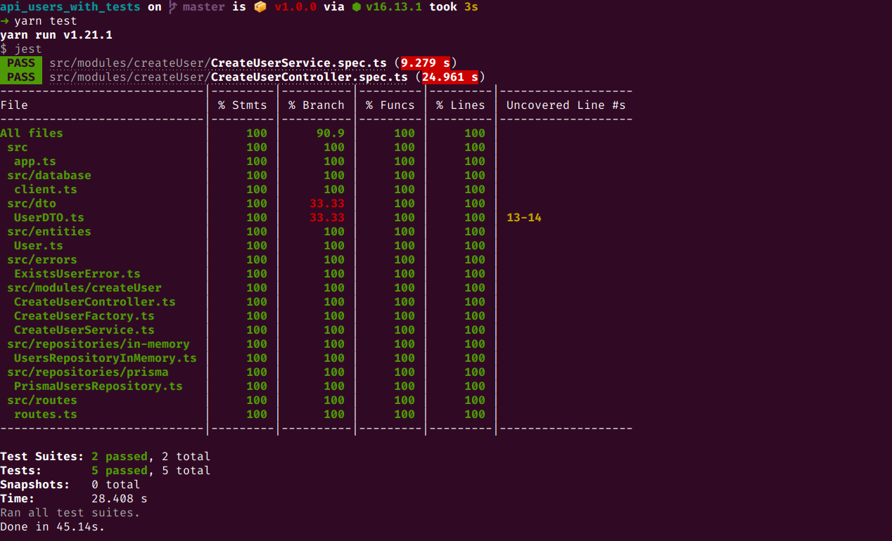

  

# API Users

Essa API foi desenvolvida no [Code/drops #93](https://www.youtube.com/watch?v=18Dgf7lb9QA) apresentado pela Daniele Leão no canal do YouTube da Rocketseat.

De forma prática foi aplicado os testes unitários e de integração, utilizando as biblioteca Jest e Supertest.

## 🧪 Tecnologias

A API desenvolvida utiliza as seguintes tecnologias:

- [NodeJS](https://nodejs.org/pt-br/)
- [TypeScript](https://www.typescriptlang.org)
- [Prisma](https://www.prisma.io/)
- [Express](https://expressjs.com/pt-br/)
- [UUID](https://www.npmjs.com/package/uuid)
- [PostgreSQL Client](https://www.npmjs.com/package/pg)
- [Jest](https://jestjs.io/pt-BR/)
- [Supertest](https://www.npmjs.com/package/supertest)

## 📝 License

Esse projeto está sob a licença MIT. Veja o arquivo [LICENSE](LICENSE) para mais detalhes.

---

Feito com 💜 by Alexandre 👋🏻
